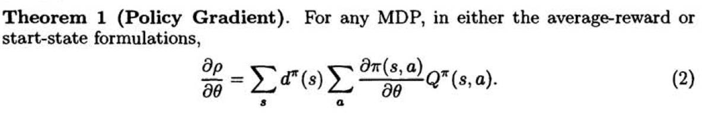
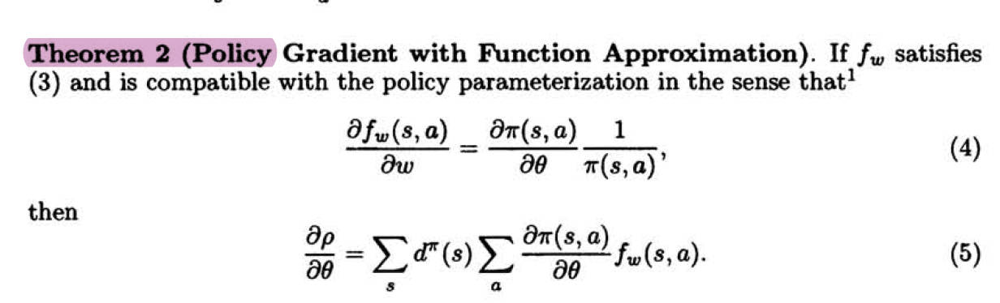
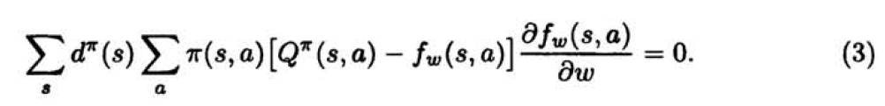
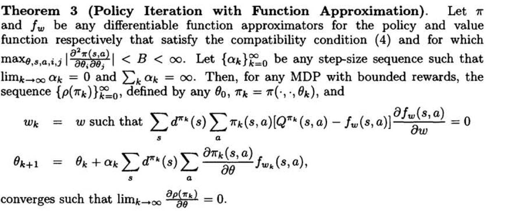

# Policy Gradient Methods for Reinforcement Learning with Function Approximation 
**Authors**: Richard S. Sutton, David McAllester, Satinder Singh, Yishay Mansour 
**Year**: 1999  
**J/C**：NIPS  
**Algorithm**: VPG  
**Citation**:5221  
## background
The dominant approach for the last decade has been the *value-function based* approach, which is oriented toward to finding deteministic policies,whereas the optimal policy is often stochastic.And it is hard to establish convergence assurances.

## highlight
- this paper proves that a form of policy iteration with function approximation is convergent to a locally optimal policy

## main contribution
This paper approximates a **stochastic policy** directly using an independent function approximator with its own parameters $\theta$.Then, in the **policy gradient**（can be policy-based or value-based) approach, the policy parameters are updated approximately proportional to the gradient $\Delta\approx\alpha\frac{\partial \rho}{\partial\theta}$ (1)    

